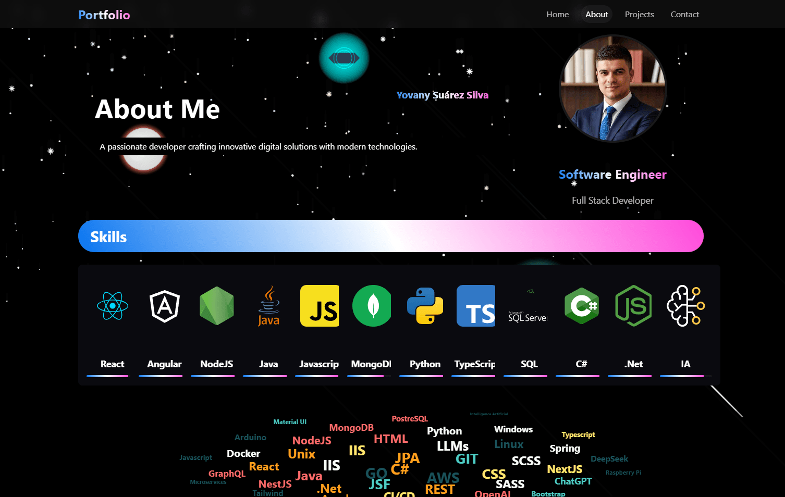

# Portfolio CDS
_This project was generated using [Angular CLI](https://github.com/angular/angular-cli) version 19.2.3._
_Portfolio of projects developed at CDS_

## Preview



========================================================================
_portfolio.cds.net.co_

_Angular Web Application for presenting portfolio of applications and services_

## Getting Started 🚀

_These instructions will allow you to get a copy of the project running on your local machine for development purposes._

See **Installation** to learn how to deploy the project.

### Prerequisites 📋

_Nodejs_
```
You need to have the nodejs server installed and running on your machine
```
_Git_
```
You need to have GIT installed and a configured account to clone the repository
```
_NPM_
```
You need to have npm installed for package management and launching angular applications
```

### Installation 🔧

_To install, clone this project, run in a terminal at the root of the project_
```
"git clone https://github.com/desobsesor/portfolio-web.git"
```
```
Run "npm i" to install the dependencies from package.js and build resources
```

_If you need to install as a service on a Windows computer, follow these instructions_

```
Activate IIS with web page services, start server
```
```
Install RewriteURL to allow access to endpoints in IIS
```
```
Create a site in IIS that points to the folder in the dist (compiled resources) 
of the portfolio-web app and start the site
```

### Deployment 🔧

_For deployment, generate the compiled version_
```
Run "npm run build" in a terminal at the root of the project, 
it generates a compiled version in dist that will be read by IIS
```

## Running the tests ⚙️

_To perform a basic test of the running service and connected to the database, follow these instructions_
```
In the browser, type the URL defined for the system "http://localhost:4200"
```

## Deployment 📦

_Open the project with Visual Studio Code or Bring and run "npm run start" in terminal to start_

## Built with 🛠️

_Tools and Technologies used_

* [NodeJS](https://nodejs.org/es/) - Server-side JavaScript environment, uses an asynchronous and event-driven model.
* [NPM](https://www.npmjs.com/) - Dependency manager
* [Angular](https://angular.io/) - Development framework
* [Trae](https://trae.ai/) - IDE for angular application development


## Contributing 🖇️

Contributions are currently not allowed.

## Versioning 📌

We use [SemVer](http://semver.org/) for versioning. For all available versions, see the [tags in this repository](https://github.com/tu/proyecto/tags).

## Authors ✒️

_Personnel in charge_

* **Yovany Suárez Silva** - *Developer* - [desobsesor](https://github.com/desobsesor)

## License 📄

This project is under the Apache license - see the [LICENSE.md](LICENSE.md) file for details

---
⌨️ with ❤ by [desobsesor](https://github.com/desobsesor)
